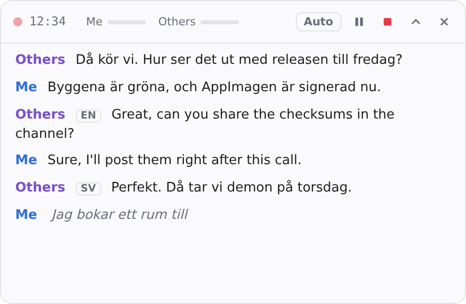
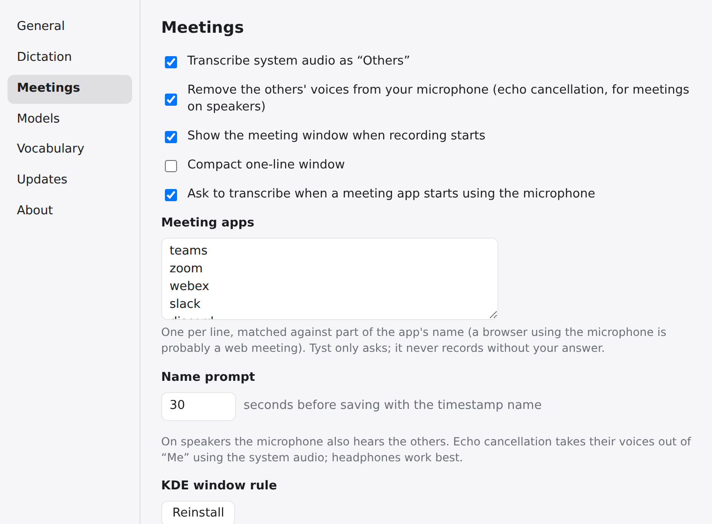
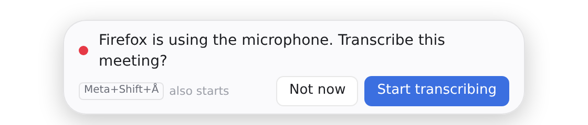

# Tyst

Local, privacy-first meeting transcription and dictation for macOS and Linux. Swedish and English,
including mixed-language meetings. Nothing leaves the device: Tyst only goes online when you ask it
to download the speech models and, if you leave update checks on, to ask GitHub for the latest
version.

Status: **v0.1.0**, the first release (see [CHANGELOG.md](CHANGELOG.md)). All phases are accepted on
Linux, tested on Arch (KDE Plasma, Wayland, PipeWire); macOS testing is pending. See [SPEC.md](SPEC.md)
for the specification and the phase reports: [5](docs/phase5-report.md) (echo cancellation, meeting
detection, updates, releases), [4](docs/phase4-report.md) (AppImage), [3](docs/phase3-report.md) (dictation),
[2](docs/phase2-report.md) (meeting app), [1](docs/phase1-report.md) (pipeline measurements) and
[0](docs/phase0-report.md) (model evaluation).

| Meeting window | Settings › Meetings |
| --- | --- |
|  |  |



## Build dependencies

Rust 1.90 or newer, Node 22, a C/C++ toolchain (`g++` and `libstdc++`, or Xcode's command line tools
on macOS), `meson` and `ninja` (they build WebRTC's echo canceller) and `clang`.

- **Arch:** `sudo pacman -S --needed base-devel clang meson ninja alsa-lib pipewire webkit2gtk-4.1 libayatana-appindicator librsvg xdotool`
- **Ubuntu 24.04:** `sudo apt install build-essential clang meson ninja-build libasound2-dev libpipewire-0.3-dev libspa-0.2-dev libwebkit2gtk-4.1-dev libayatana-appindicator3-dev librsvg2-dev libxdo-dev`
- **macOS 14.4+:** `xcode-select --install && brew install meson ninja`

`cargo build -p tyst-cli --no-default-features` builds the CLI without audio capture, and
`--no-default-features` on `tyst-runtime` also leaves out echo cancellation (no meson needed).

## Try it

```sh
cargo build --release -p tyst-cli
./target/release/tyst-cli models fetch          # Klang Pianissimo int8 + Silero VAD, verified by SHA-256
./target/release/tyst-cli transcribe meeting.wav --out-dir ~/Transcripts --title "Weekly sync"
./target/release/tyst-cli live --mic            # live partials and finals; Enter stops and prints latency/CPU
./target/release/tyst-cli meeting --mic --system # two-channel meeting without the UI, echo cancelled
./target/release/tyst-cli dictate --mic          # dictation without the pill: Enter starts and stops
./target/release/tyst-cli echo-cancel --mic me.wav --system others.wav --out me-clean.wav
./target/release/tyst-cli check-update           # asks GitHub for the latest release ($GITHUB_TOKEN while private)
```

## Meeting app

```sh
cd app/ui && npm ci && npm run tauri build -- --no-bundle   # or `npm run tauri dev`
../../target/release/tyst                                    # tray icon; onboarding on first run
../../target/release/tyst --toggle-meeting                   # start/stop from a shortcut
```

The app records your microphone (Me) and system audio (Others) as two pipelines, shows a floating
meeting window that never takes focus, and saves Markdown when you stop. On Linux it captures through
PipeWire. `tyst-cli meeting --mic --system` runs the same session without the UI.

- **Echo cancellation** (on by default, Settings › Meetings): when the others come out of your
  speakers, your microphone hears them too. Tyst removes that echo from the Me channel with WebRTC's
  AEC3, using the system audio as the reference, so their words are not written twice. Headphones
  still give the cleanest Me channel.
- **Dictation**: hold or tap the dictation shortcut (`Super+Å` on macOS, set in System Settings ›
  Shortcuts on Linux), speak, and the text is pasted where you were typing.
- **Meeting detection** (off by default, Settings › Meetings): when Teams, Zoom, a browser or
  another app from your list starts using the microphone, Tyst asks whether to transcribe. It never
  starts on its own.
- **Updates** (Settings › Updates): once a day Tyst asks GitHub whether there is a newer release and
  shows it in the tray and in Settings. It never downloads or installs anything. While the repository
  is private the check needs a GitHub token with read access, kept in the system keychain.
- **Models in memory** (Settings › General): unload the models after a few idle minutes to free
  about 1 GB; they load again when you next start.

### AppImage (Linux)

Download `Tyst_<version>_amd64.AppImage` from the [releases](https://github.com/Engfors/tyst/releases)
and check it against the signed checksums:

```sh
gpg --import tyst-release-key.asc
gpg --fingerprint 'Tyst releases'   # must be 6603 C039 2634 8BD9 8CE7  68DE E35B FE2B 59EC A014
gpg --verify SHA256SUMS.asc SHA256SUMS && sha256sum --check --ignore-missing SHA256SUMS
install -Dm755 Tyst_*_amd64.AppImage ~/.local/share/AppImage/Tyst.AppImage
~/.local/share/AppImage/Tyst.AppImage
```

The AppImage also carries an embedded GPG signature and update information
(`gh-releases-zsync`), so AppImageUpdate and similar tools can find newer releases. To build one
yourself:

```sh
packaging/linux/fetch-tools.sh      # linuxdeploy, AppRun and appimagetool at pinned, hash-checked versions
(cd app/ui && npm ci && CARGO_PROFILE_RELEASE_STRIP=debuginfo NO_STRIP=true npm run tauri build -- --bundles appimage)
packaging/linux/finish-appimage.sh target/release/bundle/appimage/Tyst_*_amd64.AppImage
packaging/linux/smoke-test-appimage.sh target/release/bundle/appimage/Tyst_*_amd64.AppImage
```

CI builds the same AppImage on Ubuntu 24.04 for every change (artifact `tyst-appimage`, unsigned).
A tag `vX.Y.Z` runs `.github/workflows/release.yml`, which builds the AppImage and the macOS app and
DMG, signs them and opens a draft release with the `CHANGELOG.md` section for that version as its
text. `NO_STRIP=true` is needed on Arch, whose libraries use ELF sections linuxdeploy's `strip`
does not know. The AppImage needs glibc 2.39 or newer with a matching `libstdc++` (Arch is fine;
Ubuntu 22.04 and Debian 12 are too old) and `fusermount3` (`fuse3`).
Models are not bundled.

### macOS

The release DMG is ad-hoc signed (there is no Developer ID yet), so macOS asks before the first
start: right-click Tyst.app, choose Open, and confirm. It needs macOS 14.4 or newer for system audio.

### Troubleshooting (Linux)

- **Blank, flickering or crashing windows on NVIDIA.** Tyst already turns off WebKitGTK's DMA-BUF
  renderer, which fixes the usual "Error 71 (Protocol error)" crash on Wayland. If the windows still
  render blank or flicker, start it with explicit sync disabled:
  `__NV_DISABLE_EXPLICIT_SYNC=1 ~/.local/share/AppImage/Tyst.AppImage`.
- **Your own voice is missing or choppy in the Me channel while others talk.** Echo cancellation
  can mistake double talk for echo on some speaker setups. Turn it off in Settings › Meetings, or
  use headphones.
- **"Keychain" errors in the log.** The update token and the paste permission are kept in the
  Secret Service (KWallet or GNOME Keyring). Without one, paste asks for keyboard access again at
  each start and the update check works only without a token.

Models live outside the repo: `~/Library/Application Support/Tyst/models` on macOS,
`~/.local/share/tyst/models` on Linux, or `$TYST_MODELS`. After downloading, `models fetch` also writes
`encoder-model.banded.int8.onnx`: the same Pianissimo encoder with its local attention computed without
256-frame block padding (same outputs, much less work for short segments; `tyst_core::encoder_rewrite`).

## License and attribution

Tyst is licensed under either of [MIT](LICENSE-MIT) or [Apache-2.0](LICENSE-APACHE), at your option.

- [Klang Pianissimo](https://huggingface.co/KlangAI/pianissimo-sv) © Klang AI AB, CC BY 4.0. Tyst runs
  a locally rewritten copy of its int8 encoder (attention graph only; weights unchanged).
- NVIDIA Parakeet TDT 0.6B v3 © NVIDIA, CC BY 4.0 (only for forced English).
- Silero VAD, MIT. ONNX Runtime, MIT. WebRTC audio processing, BSD-3-Clause.
- `crates/tyst-core/proto/onnx.proto` from [ONNX](https://github.com/onnx/onnx) v1.17.0, Apache-2.0.

[THIRD_PARTY_NOTICES.md](THIRD_PARTY_NOTICES.md) has every license, including those of the Rust
crates (regenerate with `packaging/notices/generate.sh`); the app ships it under Settings › About.
